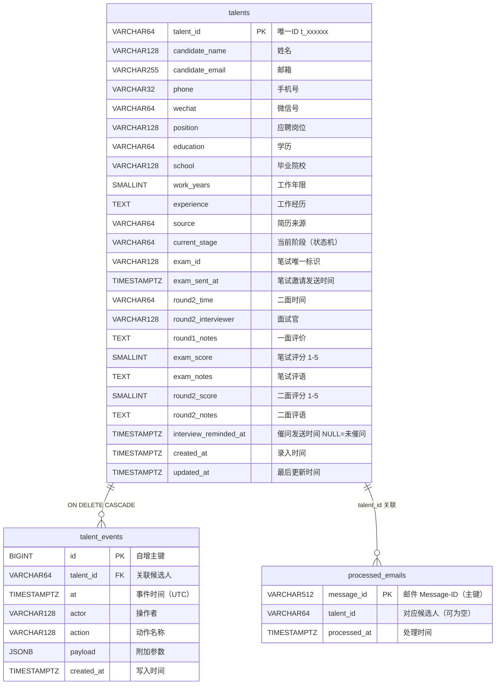

# 飞书面试管家 — recruit-ops 完整文档

> **版本**：v1.2（2026-03）  
> **运行环境**：OpenClaw Gateway · systemd 服务 `openclaw-gateway.service` · 端口 17166  
> **代码位置**：`~/.openclaw/workspace/skills/recruit-ops/`  
> **状态存储**：PostgreSQL（主）/ `~/.openclaw/recruit_state.json`（兜底）

---

## 目录

1. [老板自然语言助手（recruit-boss）](#一老板自然语言助手recruit-boss)
2. [切换邮箱 / 飞书应用](#二切换邮箱--飞书应用)
3. [产品概述](#三产品概述)
4. [HR / 老板：如何使用](#四hr--老板如何使用)
5. [完整招聘流程图](#五完整招聘流程图)
6. [命令速查](#六命令速查)
7. [技术架构](#七技术架构)
8. [每个功能的实现细节](#八每个功能的实现细节)
9. [关键设计决策](#九关键设计决策)
10. [文件与配置清单](#十文件与配置清单)
11. [数据库构建与初始化](#十一数据库构建与初始化)
12. [运维手册](#十二运维手册)
13. [测试套件](#十三测试套件)

---

## 一、老板自然语言助手（recruit-boss）

### 定位

`recruit-boss` 是专为老板/HR 设计的**自然语言前端层**，架设在 `recruit-ops` 之上。老板/HR 无需记任何结构化命令，用日常说话方式操作，机器人自动完成 "意图理解 → 候选人搜索 → 二次确认 → 执行脚本" 四步流程。

### 文件位置

```
~/.openclaw/workspace/skills/recruit-boss/
└── SKILL.md          # 唯一文件，包含所有指令逻辑
~/.openclaw/workspace/skills/recruit-ops/scripts/
└── cmd_search.py     # 候选人模糊搜索脚本（recruit-boss 专用）
```

### 工作流程

```
老板说人话
    ↓
① 意图识别（新候选人 / 已有候选人 / 查进展 / 查邮件）
    ↓
② 候选人定位
   - 查邮件类：跳过，直接执行 daily_exam_review.py
   - 新候选人：收集姓名+邮箱，调用 cmd_new_candidate.py 生成 talent_id
   - 已有候选人：运行 cmd_search.py 模糊搜索
     → 1人：直接进确认
     → 多人：列出让老板选
     → 0人：追问更多信息
    ↓
③ 向老板展示操作摘要，等待"确认"
    ↓
④ 执行 recruit-ops 对应 Python 脚本，原文返回结果
```

### 意图 → 命令映射

| 老板说的意思 | 执行脚本 | 特殊处理 |
|---|---|---|
| 新候选人（录入/刚面了个人） | `cmd_new_candidate.py` | 自动生成 talent_id；缺邮箱时追问 |
| 新候选人一面通过 | `cmd_new_candidate.py` + `cmd_round1_result.py --result pass` | 先录入，再发笔试 |
| 一面通过，跳过笔试直接二面 | `cmd_round1_result.py --result pass_direct` | 缺二面时间时追问 |
| 一面拒绝 | `cmd_round1_result.py --result reject_keep/delete` | — |
| 笔试通过，安排二面 | `cmd_exam_result.py --result pass` | 缺二面时间时追问 |
| 笔试拒绝 | `cmd_exam_result.py --result reject_keep/delete` | — |
| 二面通过 / 发 offer | `cmd_round2_result.py --result pass` | — |
| 二面结束还在考虑 | `cmd_round2_result.py --result pending` | 自动30分钟后催问 |
| 二面拒绝 | `cmd_round2_result.py --result reject_keep/delete` | — |
| 查进展 / 到哪步了 | `cmd_status.py --all` | 无需确认 |
| 查邮件 / 有没有回信 | `daily_exam_review.py` | **立即执行，无需确认** |
| 踢掉 / 移除候选人 | `cmd_remove.py --confirm` | 二次确认后执行（不可恢复） |

### talent_id 规则

`talent_id` **只能由系统自动生成**，格式为 `t_` + 6位随机小写字母数字（如 `t_ymbvxw`），由 `cmd_new_candidate.py` 执行时产生，保证全局唯一。

> ⚠️ **Agent 严禁手动编造 talent_id**（如 `xz0313`、`zhangsan0313` 等任何格式）。  
> 老板无需提供，录入时脚本自动分配，一旦分配不再改变。

### cmd_search.py 用法

```bash
cd ~/.openclaw/workspace/skills/recruit-ops/scripts

# 按姓名 / 邮箱 / 学校模糊搜索
python3 cmd_search.py --query "同济"

# 列出所有进行中候选人
python3 cmd_search.py --all-active

# 按阶段过滤
python3 cmd_search.py --query "zhang" --stage EXAM_REVIEWED
```

输出为 JSON，包含 `talent_id`、`stage`、`stage_label`、`candidate_email`、`round2_time`。

### 强制规则（关键约束）

1. 一面通过**默认走笔试流程**，只有老板主动说"直接二面/不用笔试"才走 `pass_direct`
2. `pass_direct` 时二面时间**必填**，缺时间必须追问
3. 笔试通过安排二面时二面时间**必填**，缺时间必须追问
4. **查邮件类意图立即执行**，不走确认流程
5. 每次都必须**实际运行 Python 脚本**，禁止模拟或编造结果
6. 禁止不跑 `cmd_new_candidate.py` 就直接说"已录入"

### 与 recruit-ops 的关系

```
飞书消息
    ├── 老板/HR 自然语言  →  recruit-boss (SKILL.md)  →  执行 recruit-ops 脚本
    └── HR 结构化命令     →  recruit-ops              →  直接执行对应脚本
                                                              ↓
                                              Python 脚本（core_state.py + cmd_*.py）
                                                              ↓
                                              PostgreSQL（主）/ recruit_state.json（兜底）
```

两个 skill 共享同一套 Python 脚本和状态库，互不干扰。

---

## 二、切换邮箱 / 飞书应用

### 总览

| 要改什么 | 改哪个文件 | 需要重启网关？ |
|---------|-----------|--------------|
| 发信邮箱（SMTP） | `~/.openclaw/email-send-config.json` | 不需要 |
| 收信邮箱（IMAP） | `~/.config/systemd/user/openclaw-gateway.service` | **需要** |
| 飞书 App ID / Secret | `~/.openclaw/openclaw.json` | **需要** |
| 老板飞书 open_id | `~/.config/systemd/user/openclaw-gateway.service` | **需要** |

重启命令：

```bash
systemctl --user daemon-reload
systemctl --user restart openclaw-gateway.service
```

---

### 2.1 换发信邮箱（SMTP）

**文件**：`~/.openclaw/email-send-config.json`

```json
{
  "smtp": {
    "host": "smtp.qq.com",
    "port": 587,
    "username": "你的邮箱@qq.com",
    "password": "你的授权码或应用专用密码",
    "from_email": "你的邮箱@qq.com",
    "use_tls": true
  }
}
```

常见服务商参数：

| 服务商 | host | port | 备注 |
|--------|------|------|------|
| QQ 邮箱 | `smtp.qq.com` | 587 | 需在设置中开启 SMTP，生成授权码 |
| 163 邮箱 | `smtp.163.com` | 465 | 需开启 SMTP 服务，`use_tls: true` |
| Gmail | `smtp.gmail.com` | 587 | 需开两步验证并生成应用密码 |
| 腾讯企业邮 | `smtp.exmail.qq.com` | 465 | 用登录密码或应用密码 |

> 不需要重启网关，下次发邮件时自动读取新配置。

---

### 2.2 换收信邮箱（IMAP，接收候选人笔试回信）

**文件**：`~/.config/systemd/user/openclaw-gateway.service`

找到并修改以下四行：

```ini
Environment="RECRUIT_EXAM_IMAP_HOST=imap.qq.com"
Environment="RECRUIT_EXAM_IMAP_USER=你的邮箱@qq.com"
Environment="RECRUIT_EXAM_IMAP_PASSWORD=你的授权码"
Environment="RECRUIT_EXAM_IMAP_FOLDER=INBOX"
```

常见 IMAP 参数：

| 服务商 | host | 备注 |
|--------|------|------|
| QQ 邮箱 | `imap.qq.com` | 需在设置中开启 IMAP |
| 163 邮箱 | `imap.163.com` | 需开启 IMAP 服务 |
| Gmail | `imap.gmail.com` | 需开两步验证并生成应用密码 |
| 腾讯企业邮 | `imap.exmail.qq.com` | 用登录密码 |

改完后重启：

```bash
systemctl --user daemon-reload && systemctl --user restart openclaw-gateway.service
```

> **建议收发邮箱用同一个**，候选人回复的邮件才能被 IMAP 收到。

---

### 2.3 换飞书应用（App ID / App Secret）

**文件**：`~/.openclaw/openclaw.json`

搜索 `feishubot`，修改对应字段：

```json
"accounts": {
  "feishubot": {
    "appId": "cli_新应用的AppID",
    "appSecret": "新应用的AppSecret"
  }
}
```

新飞书应用需要在飞书开发者后台开通以下权限：

| 权限 | 用途 |
|------|------|
| `calendar:calendar` | 读取机器人日历 |
| `calendar:event:write` | 创建日历事件 |
| `contact:contact.base:readonly` | 读取用户基本信息 |
| `im:message` | 接收和发送消息 |

改完后重启网关。

---

### 2.4 换老板飞书账号（日历邀请对象）

**文件**：`~/.config/systemd/user/openclaw-gateway.service`

```ini
Environment="FEISHU_BOSS_OPEN_ID=ou_新老板的open_id"
```

**如何获取新老板的 open_id：**

```bash
# 已知手机号时，调用飞书 API 查询（需 tenant_access_token）
curl -X POST 'https://open.feishu.cn/open-apis/contact/v3/users/batch_get_id' \
  -H 'Authorization: Bearer <tenant_access_token>' \
  -H 'Content-Type: application/json' \
  -d '{"mobiles": ["13800138000"]}'
```

或让新老板在飞书个人资料页查看自己的 open_id，也可通过飞书开发者后台的「用户管理」查找。

改完后重启网关。

---

## 三、产品概述

**飞书面试管家**将 OpenClaw AI 网关接入飞书，让 HR 和老板在飞书招聘协作群里完成整条招聘闭环。系统提供两种交互方式：

### 两种使用模式

| 模式 | 适用人群 | 使用方式 | Skill |
|------|---------|---------|-------|
| **自然语言** | 老板/HR（直接说人话） | "刚面了个人，不错，邮箱是 xxx@xxx.com" | `recruit-boss` |
| **结构化命令** | HR（熟悉命令格式） | `/round1_result talent_id=xxx result=pass email=xxx` | `recruit-ops` |

### 完整功能一览

| 阶段 | 结构化命令（HR） | 自然语言（老板）示例 | 系统自动完成 |
|------|----------------|-------------------|------------|
| 录入候选人 | `/new_candidate` | "刚面了个人，叫小张" | 生成 talent_id，写入人才库 |
| 一面通过→发笔试 | `/round1_result result=pass` | "小张一面通过，帮发笔试" | 发笔试邀请邮件（含题目附件） |
| 一面通过→直接二面 | `/round1_result result=pass_direct` | "这人很强，不用笔试，直接二面" | 发二面通知 + 飞书日历 |
| 一面拒绝 | `/round1_result result=reject_keep/delete` | "这个人不合适，拒了" | 状态归档 |
| 笔试审阅 | `/daily_exam_review` | "有没有人回信了" | 从邮箱拉取回信，代码/文本预审 |
| 笔试通过→安排二面 | `/exam_result result=pass` | "笔试过了，下周三下午两点安排二面" | 发二面通知 + 飞书日历 |
| 笔试拒绝 | `/exam_result result=reject_keep/delete` | "笔试没过，拒了" | 状态归档 |
| 二面结束待定 | `/round2_result result=pending` | "二面完了，我还在考虑" | 标记待定，30分钟后自动飞书催问 |
| 二面通过 | `/round2_result result=pass` | "二面过了，可以发 offer 了" | 状态推进至 Offer handoff |
| 二面拒绝 | `/round2_result result=reject_keep/delete` | "二面没过，保留在库里" | 状态归档 |
| 状态查询 | `/recruit_status` | "招聘现在到哪步了" | 返回候选人当前阶段 + 审计历史 |

**设计边界：**
- OpenClaw **只做流程编排和审计**，不是公司主人才库
- 候选人数据来源于 HR 手动填写或老板口述，主数据在公司内部系统
- Offer 发放由 HR 线下完成，系统不自动发 Offer

---

## 四、HR / 老板：如何使用

### 前置条件

- 已加入**招聘协作群**（包含：HR、老板、OpenClaw 机器人）
- 机器人已配置飞书 WebSocket 模式，无需公网 URL

### 老板：直接说人话即可

老板无需记任何命令格式，直接在飞书对话框用自然语言操作：

```
刚面了个人，不错，叫小张，邮箱是 zhangsan@company.com
→ 机器人自动录入候选人，生成 talent_id，确认后可继续

小张一面通过，帮发笔试
→ 自动发笔试邀请邮件（含题目附件 笔试题.tar）

这人很强，不用笔试了，下周五下午三点直接二面
→ 跳过笔试，直接安排二面 + 创建飞书日历

那个同济的笔试过了，下周三上午十点安排二面
→ 搜索候选人，确认后执行

二面完了，小张可以发 offer 了
→ 状态推进至 Offer 阶段，提醒 HR 跟进

招聘现在到哪步了？
→ 列出所有进行中候选人的阶段

有没有人交作业了
→ 直接拉取笔试邮件，返回预审报告
```

机器人在执行前会向老板**二次确认**（查询类和查邮件类除外），老板回"确认"或"是"后执行。

---

### HR：使用结构化命令

#### 第零步：录入候选人

```
/new_candidate name=张伟 email=zhangwei@test.com position=后端工程师 education=本科 school=清华 work-years=4 source=Boss直聘
```

机器人回复示例：

```
✅ 候选人已录入人才库
- talent_id : t_ymbvxw
- 姓名     : 张伟
- 邮箱     : zhangwei@test.com
- 岗位     : 后端工程师
- 当前阶段 : NEW（等待一面结果）
```

---

#### 第一步：一面结束，HR 记录结果

通过后，在飞书群发：

```
/round1_result talent_id=t_ymbvxw result=pass email=zhangwei@test.com
```

拒绝时（保留人才库）：

```
/round1_result talent_id=t_ymbvxw result=reject_keep
```

拒绝时（移除）：

```
/round1_result talent_id=t_ymbvxw result=reject_delete
```

机器人回复示例（通过时）：

```
OK: 已将 talent_id=t_ymbvxw 标记为一面通过，笔试邀请邮件发送中（收件: zhangwei@test.com）
```

> 候选人同时收到邮件，包含笔试题附件 `笔试题.tar`

---

#### 第二步：每日审阅笔试回信

```
/daily_exam_review
```

机器人从笔试邮箱（IMAP）拉取所有候选人的回信，返回：
- 邮件正文节选
- 代码/文本预审摘要（行数、结构分析、风险点）
- 附件预览（Jupyter Notebook、压缩包等）

> 也可不手动触发——Cron 每5分钟自动扫描，有新回信时自动推送飞书通知。

---

#### 第三步：笔试审阅完成，决定是否进入二面

通过后：

```
/exam_result talent_id=t_ymbvxw result=pass round2-time="2026-04-20 14:00" interviewer=老板
```

机器人自动完成：
1. 向候选人发送二面通知邮件（含时间、面试官信息）
2. 在老板飞书日历创建二面事件（老板收到日历邀请通知）

---

#### 第四步：二面结束，记录结果

```
/round2_result talent_id=t_ymbvxw result=pass notes=技术扎实，沟通顺畅
```

机器人回复：`[二面通过 - Offer 待发放]`，提醒 HR 手动启动 Offer 流程。

二面结束但还未决定时：

```
/round2_result talent_id=t_ymbvxw result=pending
```

> 系统标记为 `ROUND2_DONE_PENDING`，**30分钟后自动飞书催问**老板给出最终结论。

---

#### 随时查询候选人状态

```
/recruit_status talent_id=t_ymbvxw    # 查单人
/recruit_status                         # 列出所有候选人
```

---

## 五、完整招聘流程图

```
新建候选人
cmd_new_candidate.py
      │ stage=NEW
      ▼
/round1_result talent_id=xxx result=?
      │
      ├── pass_direct ──────────────────────────────────────┐
      │                                                      │
      ├── pass                                               │
      │     ↓                                                │
      │  EXAM_PENDING（自动发笔试邀请邮件）                    │
      │     │                                                │
      │  候选人回复邮件提交答案                                 │
      │     │                                                │
      │  Cron每5分钟自动扫描 / 手动 /daily_exam_review        │
      │  (IMAP拉取回信 + 预审 + 推飞书通知)                     │
      │     ↓                                                │
      │  EXAM_REVIEWED                                       │
      │     │                                                │
      │  /exam_result talent_id=xxx result=?                 │
      │     │                                                │
      │     ├── pass ──────────────────────────────────────►│
      │     ├── reject_keep  → ROUND1_DONE_REJECT_KEEP      │
      │     └── reject_delete → ROUND1_DONE_REJECT_DELETE    │
      │                                                      │
      ├── reject_keep  → ROUND1_DONE_REJECT_KEEP             │
      └── reject_delete → ROUND1_DONE_REJECT_DELETE          │
                                                             ▼
                                               ROUND2_SCHEDULED
                                         (自动发二面邮件 + 创建飞书日历)
                                                             │
                                         /round2_result talent_id=xxx result=?
                                                             │
                                    ┌────────────────────────┼──────────────────────┐
                                    │                        │                      │
                                  pass                   pending             reject_keep/delete
                                    │                        │                      │
                                    ▼                        ▼                      ▼
                             OFFER_HANDOFF      ROUND2_DONE_PENDING     ROUND2_DONE_REJECT_KEEP
                          (提醒HR手动发Offer)         │                  ROUND2_DONE_REJECT_DELETE
                                               30分钟后Cron
                                               自动飞书催问
                                                   │
                                                   ▼
                                            给出最终结论
                                       （pass / reject_keep / reject_delete）
```

### 阶段说明

| 阶段标识 | 中文含义 |
|---------|---------|
| `NEW` | 新建，尚未开始 |
| `EXAM_PENDING` | 笔试进行中（已发邀请，等候选人回信） |
| `EXAM_REVIEWED` | 笔试已审阅（扫信完成） |
| `ROUND2_SCHEDULED` | 二面已安排 |
| `ROUND2_DONE_PENDING` | 二面结束，结论待定（30分钟后自动催问） |
| `OFFER_HANDOFF` | 等待发放 Offer |
| `ROUND1_DONE_REJECT_KEEP` | 一面/笔试未通过（保留人才库） |
| `ROUND1_DONE_REJECT_DELETE` | 一面/笔试未通过（已移除） |
| `ROUND2_DONE_REJECT_KEEP` | 二面未通过（保留人才库） |
| `ROUND2_DONE_REJECT_DELETE` | 二面未通过（已移除） |

---

## 六、命令速查

| 命令 / 脚本 | 参数 | 说明 |
|---|---|---|
| `cmd_new_candidate.py` | `--name` `--email` `[--position --phone --education --school --work-years --experience --source --wechat]` | 新建候选人，系统自动分配 talent_id |
| `/round1_result` | `talent_id` `result(pass/pass_direct/reject_keep/reject_delete)` `email`（pass时必填）`round2-time`（pass_direct时必填） | 一面结果 |
| `/daily_exam_review` | 无（`--force` 可强制不去重） | 每日笔试审阅 |
| `/exam_result` | `talent_id` `result(pass/reject_keep/reject_delete)` `round2-time`（pass时必填）`interviewer`（可选） | 笔试结果 |
| `/round2_result` | `talent_id` `result(pending/pass/reject_keep/reject_delete)` `notes`（可选） | 二面结果 |
| `/recruit_status` | `talent_id`（可选，不填=列出所有） | 状态查询 |
| `cmd_remove.py` | `--talent-id` `--confirm` | 移除候选人（物理删除，需二次确认） |
| `cmd_search.py` | `--query <关键词>` 或 `--all-active` | 候选人模糊搜索 |

> **`talent_id` 规则**：格式为 `t_` + 6位随机小写字母数字（如 `t_ymbvxw`），由 `cmd_new_candidate.py` 自动生成，唯一，不可重复，Agent 禁止手动编造。

---

## 七、技术架构

```
飞书招聘协作群
      │  WebSocket（飞书 OpenAPI，长连接模式，无需公网 URL）
      ▼
OpenClaw Gateway（:17166）
      │  飞书通道插件路由 → recruit-boss / recruit-ops skill
      ▼
LLM Agent（qwen3-max-2026-01-23，Context 256K tokens）
      │  exec tool 调用 Python 脚本
      ▼
scripts/
  ├── cmd_new_candidate.py     # 新建候选人（系统自动生成 talent_id）
  ├── cmd_round1_result.py     # 一面结果 + 笔试邮件（后台 Popen）
  ├── daily_exam_review.py     # IMAP 拉取 + 预审 + 输出飞书消息
  ├── cmd_exam_result.py       # 笔试结果 + 二面邮件（后台 Popen）+ 日历（后台 Popen）
  ├── cmd_round2_result.py     # 二面结果（含 pending 催问）+ Offer handoff
  ├── cmd_status.py            # 候选人状态查询
  ├── cmd_search.py            # 候选人模糊搜索（recruit-boss 专用）
  ├── cmd_remove.py            # 候选人物理删除（需二次确认）
  ├── cmd_interview_reminder.py # Cron 催问：检查 ROUND2_DONE_PENDING 超时候选人
  ├── feishu_calendar.py       # 飞书日历 API 封装（创建事件 + 邀请参与者）
  ├── feishu_notify.py         # 飞书 IM API 直推（Cron 场景无 Gateway 时使用）
  ├── core_state.py            # 状态机引擎 + 审计日志（双存储入口）
  └── talent_db.py             # PostgreSQL 读写封装（优先于 JSON 文件）

外部依赖：
  ~/.openclaw/email-send-config.json    # SMTP 配置（发信）
  ~/.openclaw/recruit-email-config.json # IMAP 配置（收信）
  ~/.openclaw/talent-db-config.json     # PostgreSQL 连接参数
  ~/.openclaw/openclaw.json             # 飞书 app_id / app_secret
  ~/.openclaw/extensions/feishu-recruit-bot/exam_txt/笔试题.tar  # 随邀请邮件附上
```

### 关键技术选型

| 问题 | 方案 |
|------|------|
| OpenClaw exec 工具约 3 秒超时 | 邮件和日历全部用 `subprocess.Popen(start_new_session=True)` 后台独立进程执行，不阻塞主流程 |
| 飞书日历邀请参与者 | 先 POST 创建事件，再单独 POST `/attendees?user_id_type=open_id` 添加参与者（两步） |
| 状态保存与网络调用顺序 | `save_state()` 永远在 Popen 之前调用，确保超时时状态不丢失 |
| Python 3.6 兼容 | 所有类型注解使用 `typing` 模块，不用 `X \| Y` 语法 |
| 幂等性 | 检测候选人当前 stage，已在目标阶段则直接返回，不重复发邮件/日历 |
| 数据持久化 | PostgreSQL 为主存储；`psycopg2` 未安装或未配置密码时自动降级到 JSON 文件 |
| Cron 推送（无 Gateway 连接） | `feishu_notify.py` 直接调飞书 IM API，不经 OpenClaw 中继 |
| 邮件去重 | `processed_emails` 表（PG/JSON）手动扫描与 Cron 自动扫描共用，避免重复通知 |

---

## 八、每个功能的实现细节

### 8.1 新建候选人 — `cmd_new_candidate.py`

**执行流程：**
1. 解析参数：`--name`（必填）、`--email`（必填）及可选字段
2. 调用 `core_state.load_state()` 读取当前状态
3. 生成唯一 `talent_id`：`t_` + 20次重试确保不碰撞
4. 构建候选人记录，`stage = NEW`
5. 调用 `save_state()` 持久化
6. stdout 打印录入确认（含 talent_id），Agent 原文返回给老板

---

### 8.2 `/round1_result` — 一面结果（`cmd_round1_result.py`，248行）

**执行流程：**
1. 解析参数：`--talent-id`、`--result`、`--email`
2. 调用 `core_state.load_state()` 读取状态
3. 检查当前阶段是否允许跳转（`ensure_stage_transition`）
4. **pass 分支**：
   - 写入 `candidate_email`、生成 `exam_id`（格式：`exam-{talent_id}-{时间戳}`）
   - 调用 `append_audit()` 写审计记录
   - 调用 `save_state()` **先保存状态**
   - 用 `subprocess.Popen(start_new_session=True)` 后台调用 `email_send.py`，附带笔试题附件（`笔试题.tar`）
5. **pass_direct 分支**：跳过笔试，直接写入 `round2_time`，后台发二面邮件 + 创建飞书日历
6. **reject 分支**：直接更新状态 + 审计，不发邮件

**幂等处理**：候选人已在 `EXAM_PENDING` 或 `EXAM_REVIEWED` 时，追加审计记录但不重发邮件。

---

### 8.3 `/daily_exam_review` — 笔试邮件审阅（`daily_exam_review.py`，508行）

**执行流程：**
1. 从 DB/JSON 读取所有 `stage == EXAM_PENDING` 的候选人
2. 通过 IMAP（`imaplib`）连接笔试邮箱，搜索各候选人邮箱的回信
3. **去重检查**：查询 `processed_emails` 表，跳过已处理邮件
4. 对每封新邮件：
   - 解析 MIME 结构，提取正文和附件（`message_to_text_and_attachments`）
   - 解码 MIME 编码的主题和文件名（`decode_mime_words`）
   - 调用 `classify_attachments()` 分类：代码文件（`.py/.js/.ipynb` 等）、压缩包、其他
   - 调用 `auto_review_code()` 或 `auto_review_text()` 做规则预审
5. 格式化为 Markdown 输出（含：候选人邮箱、邮件主题、正文节选、预审摘要、附件清单）
6. 更新候选人状态为 `EXAM_REVIEWED`，写审计日志
7. **`--auto` 模式**（Cron 调用）：有新回信则输出（Agent 推送飞书），无新回信则静默不输出

**预审规则（rule-based，不调用 LLM）：**
- 代码：统计行数、识别函数/类定义、检查是否有注释
- 文本：统计字数、检查是否回答了所有题目、识别风险词

---

### 8.4 `/exam_result` — 笔试结果 + 二面安排（`cmd_exam_result.py`，277行）

**执行流程（pass 分支）：**
1. 校验当前阶段为 `EXAM_PENDING` 或 `EXAM_REVIEWED`
2. 写入 `round2_time`、`round2_interviewer` 到候选人记录
3. 写审计记录
4. **`save_state()` 先保存状态**（关键：在所有网络调用之前）
5. 用 `Popen(start_new_session=True)` 后台发送二面通知邮件
6. 用 `_spawn_calendar_bg()` 后台调用 `feishu_calendar.py` 创建日历事件

**日历创建细节（`feishu_calendar.py`，244行）：**
1. 从 `~/.openclaw/openclaw.json` 读取飞书 `app_id` / `app_secret`
2. 调用 `POST /auth/v3/tenant_access_token/internal` 获取 `tenant_access_token`
3. 调用 `POST /calendar/v4/calendars/{calendar_id}/events` 创建事件
4. 调用 `POST /calendar/v4/calendars/{calendar_id}/events/{event_id}/attendees?user_id_type=open_id` 邀请老板
   - 老板 `open_id` 来自环境变量 `FEISHU_BOSS_OPEN_ID`
   - 设置 `need_notification: true`，老板收到飞书日历邀请通知

**为什么分两步添加参与者？**  
飞书日历 API 在创建事件时直接传 `attendees` 字段不会触发邀请通知，必须在事件创建后单独调用 `/attendees` 接口才能让被邀请人收到通知。

---

### 8.5 `/round2_result` — 二面结果（`cmd_round2_result.py`，141行）

**执行流程：**
1. 校验当前阶段为 `ROUND2_SCHEDULED` 或 `ROUND2_DONE_PENDING`
2. **pending 分支** → 状态更新为 `ROUND2_DONE_PENDING`，写入当前时间为二面时间，清空 `interview_reminded_at`（重置催问计时器）
3. **pass 分支** → 状态更新为 `OFFER_HANDOFF`，打印 Offer handoff 提示
4. **reject 分支** → 状态更新为 `ROUND2_DONE_REJECT_KEEP` / `ROUND2_DONE_REJECT_DELETE`
5. 所有分支写审计日志，调用 `save_state()`

---

### 8.6 `/recruit_status` — 状态查询（`cmd_status.py`，131行）

- `--talent-id <ID>`：输出单个候选人的阶段标签、邮箱、审计历史（最近 5 条）
- `--all`：遍历所有候选人，输出一览表

阶段标签映射（中文）在 `STAGE_LABELS` 字典中定义，飞书消息直接展示：

| stage 标识 | 展示文字 |
|---|---|
| `NEW` | 新建 |
| `EXAM_PENDING` | 笔试进行中 |
| `EXAM_REVIEWED` | 笔试已审阅 |
| `ROUND2_SCHEDULED` | 二面已安排 |
| `ROUND2_DONE_PENDING` | 二面结束待定 |
| `OFFER_HANDOFF` | 等待发放 Offer |
| `ROUND1_DONE_REJECT_KEEP` | 一面未通过（保留） |
| `ROUND1_DONE_REJECT_DELETE` | 一面未通过（移除） |
| `ROUND2_DONE_REJECT_KEEP` | 二面未通过（保留） |
| `ROUND2_DONE_REJECT_DELETE` | 二面未通过（移除） |

---

### 8.7 状态机引擎（`core_state.py`，110行）

核心函数：

| 函数 | 作用 |
|------|------|
| `load_state()` | 优先从 PostgreSQL 加载；未配置 DB 时从 JSON 文件读取；文件不存在/损坏时返回空结构 |
| `save_state(state)` | 配置了 DB 时只写 PostgreSQL；未配置时原子写入 JSON 文件（.tmp替换） |
| `get_candidate(state, talent_id)` | 获取或初始化候选人记录（默认 stage=NEW） |
| `ensure_stage_transition(cand, allowed_from, target)` | 检查当前阶段是否在白名单内，合法则更新 stage，否则返回 False |
| `append_audit(cand, actor, action, payload)` | 追加一条审计记录（含 ISO 时间戳） |
| `normalize_for_save(state)` | 确保每个候选人有 `audit` 字段，防止保存格式错误 |

合法阶段集合（`STAGES`）：

```python
STAGES = {
    "NEW",
    "ROUND1_SCHEDULED", "ROUND1_DONE_PASS",
    "ROUND1_DONE_REJECT_KEEP", "ROUND1_DONE_REJECT_DELETE",
    "EXAM_PENDING", "EXAM_REVIEWED",
    "ROUND2_SCHEDULED",
    "ROUND2_DONE_PENDING", "ROUND2_DONE_PASS",
    "ROUND2_DONE_REJECT_KEEP", "ROUND2_DONE_REJECT_DELETE",
    "OFFER_HANDOFF",
}
```

---

## 九、关键设计决策

### 9.1 exec 超时问题与后台进程方案

OpenClaw 的 `exec` 工具有约 **3 秒超时**，而邮件发送（SMTP）需要约 3-5 秒，飞书日历 API 需要约 8-12 秒。

**解决方案**：所有网络操作用 `subprocess.Popen(start_new_session=True)` 启动，相当于 `setsid`，创建独立进程组。当 exec 的父进程组被 OpenClaw 终止时，独立进程组中的子进程不受影响，继续完成网络调用。

```
exec 超时 kill 父进程
      │
      ├─ 主脚本（已完成 save_state）← 正常终止
      │
      └─ 邮件进程 / 日历进程（start_new_session=True）← 继续运行，独立 session
```

日志文件：
- 邮件后台日志：`/tmp/email_round1_*.log`、`/tmp/email_round2_*.log`
- 日历后台日志：`/tmp/feishu_cal_*.log`
- 总日志索引：`/tmp/email_bg.log`、`/tmp/feishu_calendar_bg.log`

### 9.2 状态保存优先于网络调用

```python
# 正确顺序（所有 cmd_*.py 均遵循此顺序）
save_state(state)              # ① 先保存
_spawn_email_bg(...)           # ② 后启动邮件后台进程（后台）
_spawn_calendar_bg(...)        # ③ 后启动日历后台进程（后台）
```

即使后台网络调用失败，状态已持久化，不会丢失。

### 9.3 飞书日历邀请必须两步

```
POST /calendar/v4/calendars/{id}/events                                    # 创建事件（不触发通知）
POST /calendar/v4/calendars/{id}/events/{event_id}/attendees?user_id_type=open_id  # 添加参与者（触发通知）
```

### 9.4 定时任务（Cron）

系统有两个持续运行的 Cron，均为**每5分钟触发一次**（`*/5 * * * *`）：

| Cron ID | 名称 | 触发条件 | 执行脚本 |
|---|---|---|---|
| `recruit-email-auto-scan` | 候选人回信自动扫描 | 有新回信时推飞书，无则静默 | `daily_exam_review.py --auto` |
| `recruit-interview-reminder` | 二面结束后自动催问 | 有 ROUND2_DONE_PENDING 超时候选人时推飞书 | `cmd_interview_reminder.py` |

> ⚠️ 原来的"每天 23:00 运行一次笔试审阅"任务（`recruit-daily-exam-review`）已**禁用**，已被上述自动扫描替代。

### 9.5 双存储降级策略

```
psycopg2 已安装 AND TALENT_DB_PASSWORD 已配置
    ├── 是 → 所有读写走 PostgreSQL（talent_db.py）
    └── 否 → 自动降级到 JSON 文件（原子写入 .tmp 再替换）
```

配置文件：`~/.openclaw/talent-db-config.json`

---

## 十、文件与配置清单

### 代码文件

| 文件 | 行数 | 职责 |
|------|------|------|
| `scripts/core_state.py` | 110 | 状态机引擎、审计日志、双存储入口（PG/JSON） |
| `scripts/talent_db.py` | ~500 | PostgreSQL 读写封装，状态与 talents 表互转 |
| `scripts/cmd_new_candidate.py` | ~80 | 新建候选人，自动生成 talent_id（t_xxxxxx） |
| `scripts/cmd_round1_result.py` | 248 | 一面结果，含笔试邮件后台发送 |
| `scripts/daily_exam_review.py` | 508 | IMAP 拉信、MIME 解析、规则预审、去重、输出 |
| `scripts/cmd_exam_result.py` | 277 | 笔试结果、二面邮件、飞书日历（均后台进程） |
| `scripts/cmd_round2_result.py` | 141 | 二面结果（含 pending）、Offer handoff |
| `scripts/cmd_status.py` | 131 | 候选人状态查询，支持单人/全员 |
| `scripts/cmd_search.py` | ~100 | 模糊搜索候选人，支持姓名/邮箱/学校/阶段过滤 |
| `scripts/cmd_remove.py` | ~80 | 物理删除候选人，需 `--confirm` 二次确认 |
| `scripts/cmd_interview_reminder.py` | ~60 | Cron 催问：检查 ROUND2_DONE_PENDING 超时 |
| `scripts/feishu_calendar.py` | 244 | 飞书日历 API 封装（两步法：创建 + 邀请参与者） |
| `scripts/feishu_notify.py` | ~120 | 飞书 IM API 直推，Cron 无 Gateway 连接时使用 |
| `scripts/exam_prereview.py` | ~600 | 笔试预审增强版（代码质量深度分析） |

### 配置与数据文件

| 文件 | 位置 | 说明 |
|------|------|------|
| 候选人状态库（兜底） | `~/.openclaw/recruit_state.json` | PG 不可用时的 JSON 存储 |
| IMAP 收信配置 | `~/.openclaw/recruit-email-config.json` | 笔试收件邮箱参数 |
| PostgreSQL 连接配置 | `~/.openclaw/talent-db-config.json` | 主数据库连接参数 |
| SMTP 发信配置 | `~/.openclaw/email-send-config.json` | QQ SMTP 发信 |
| OpenClaw 主配置 | `~/.openclaw/openclaw.json` | 飞书 App ID/Secret、网关、Agent 配置 |
| Cron 任务配置 | `~/.openclaw/cron/jobs.json` | 定时任务列表 |
| 笔试题附件 | `~/.openclaw/extensions/feishu-recruit-bot/exam_txt/笔试题.tar` | 随笔试邀请邮件自动附上 |

### 环境变量（`~/.config/systemd/user/openclaw-gateway.service`）

| 变量名 | 说明 |
|--------|------|
| `RECRUIT_STATE_PATH` | 状态文件路径（`~/.openclaw/recruit_state.json`） |
| `RECRUIT_EXAM_IMAP_HOST` | IMAP 服务器（`imap.qq.com`） |
| `RECRUIT_EXAM_IMAP_USER` | 笔试收件邮箱账号 |
| `RECRUIT_EXAM_IMAP_PASSWORD` | IMAP 密码/授权码 |
| `RECRUIT_EXAM_IMAP_FOLDER` | 收件箱目录（`INBOX`） |
| `FEISHU_BOSS_OPEN_ID` | 老板飞书 open_id，用于日历邀请和催问推送 |

### 飞书应用信息

| 字段 | 值 |
|------|---|
| App ID | `<YOUR_FEISHU_APP_ID>` |
| 机器人 open_id | `<YOUR_BOT_OPEN_ID>` |
| 机器人日历 ID | `<YOUR_BOT_CALENDAR_ID>` |
| 老板 open_id | `<YOUR_BOSS_OPEN_ID>` |
| 已开通权限 | `calendar:calendar`、`calendar:event:write`、`contact:contact.base:readonly`、`im:message` |

---

## 十一、数据库架构

系统使用本地 **PostgreSQL**（库名 `recruit`，用户 `recruit_app`）作为主存储，共三张表。未配置 PostgreSQL 时自动降级为 JSON 文件（`recruit_state.json`）。

### 三张表总览

```
recruit 库
  ├── talents          人才主表        每位候选人一行，存静态信息 + 当前流程状态
  ├── talent_events    事件流水表      每次操作追加一行，即审计日志（append-only）
  └── processed_emails 邮件去重表      记录已处理过的回信，防止重复推送
```



---

### 表1：`talents` — 人才主表

每位候选人占一行，贯穿整个招聘周期。字段分为四组：

**① 基本信息**

| 字段 | 数据类型 | 存储内容 | 何时写入 |
|------|---------|---------|---------|
| `talent_id` | `VARCHAR(64)` UNIQUE NOT NULL | 系统唯一ID，格式 `t_xxxxxx` | 录入时自动生成 |
| `candidate_name` | `VARCHAR(128)` | 候选人姓名 | 录入时 |
| `candidate_email` | `VARCHAR(255)` | 邮箱（笔试邀请、二面通知的发送目标） | 录入时 |
| `phone` | `VARCHAR(32)` | 手机号 | 录入时（可选） |
| `wechat` | `VARCHAR(64)` | 微信号 | 录入时（可选） |
| `position` | `VARCHAR(128)` | 应聘岗位 | 录入时（可选） |
| `education` | `VARCHAR(64)` | 学历（本科/硕士/博士） | 录入时（可选） |
| `school` | `VARCHAR(128)` | 毕业院校 | 录入时（可选） |
| `work_years` | `SMALLINT` | 工作年限（整数） | 录入时（可选） |
| `experience` | `TEXT` | 工作经历简述（自然语言，不限长度） | 录入时（可选） |
| `source` | `VARCHAR(64)` | 简历来源（Boss直聘/猎头/内推/官网等） | 录入时（可选） |

**② 流程状态**

| 字段 | 数据类型 | 存储内容 | 何时写入 |
|------|---------|---------|---------|
| `current_stage` | `VARCHAR(64)` NOT NULL | 当前所处阶段（状态机核心字段） | 每次阶段变更时更新 |
| `exam_id` | `VARCHAR(128)` | 笔试唯一标识，格式 `exam-{talent_id}-{时间戳}` | 一面通过、发笔试时生成 |
| `exam_sent_at` | `TIMESTAMPTZ` | 笔试邀请邮件的实际发送时间 | 笔试邀请发出后写入 |
| `round2_time` | `VARCHAR(64)` | 二面时间字符串（`YYYY-MM-DD HH:MM`） | 安排二面时写入 |
| `round2_interviewer` | `VARCHAR(128)` | 面试官姓名 | 安排二面时写入（可选） |

**③ 面试评价**

| 字段 | 数据类型 | 存储内容 | 何时写入 |
|------|---------|---------|---------|
| `round1_notes` | `TEXT` | 一面评价（HR/老板的自然语言描述） | 记录一面结果时 |
| `exam_score` | `SMALLINT` | 笔试评分（1-5 分） | 笔试审阅后；预审初评不覆盖人工填写 |
| `exam_notes` | `TEXT` | 笔试评语；自动预审摘要**追加**到末尾，不覆盖已有内容 | 笔试审阅后 |
| `round2_score` | `SMALLINT` | 二面评分（1-5 分） | 记录二面结果时 |
| `round2_notes` | `TEXT` | 二面评语 | 记录二面结果时 |

**④ 自动化标记**

| 字段 | 数据类型 | 存储内容 | 何时写入 |
|------|---------|---------|---------|
| `interview_reminded_at` | `TIMESTAMPTZ` | 二面催问消息的发送时间；`NULL` 表示尚未催问 | Cron 催问任务执行后写入 |
| `created_at` | `TIMESTAMPTZ` NOT NULL | 候选人录入时间，默认 `NOW()` | 首次写入时自动设置 |
| `updated_at` | `TIMESTAMPTZ` NOT NULL | 最后更新时间，默认 `NOW()` | 每次 upsert 时自动更新 |

写入策略：按 `talent_id` 做 **upsert**（存在则更新，不存在则插入），天然幂等。

---

### 表2：`talent_events` — 事件流水表

对应 JSON 中的 `audit` 数组，记录每一次操作的完整历史，**只追加、从不修改或删除**。

| 字段 | 数据类型 | 存储内容 | 示例 |
|------|---------|---------|------|
| `talent_id` | `VARCHAR(64)` NOT NULL | 关联的候选人（外键） | `t_ymbvxw` |
| `at` | `TIMESTAMPTZ` NOT NULL | 事件发生时间（UTC） | `2026-03-13T09:52:17Z` |
| `actor` | `VARCHAR(128)` NOT NULL | 操作者 | `system` / 用户 open_id |
| `action` | `VARCHAR(128)` NOT NULL | 动作名称 | `round1_pass_and_exam_invite_sent` |
| `payload` | `JSONB` | 附加参数，因动作而异 | `{"email":"xx@xx.com","exam_id":"exam-..."}` |

常见 `action` 值：

| action | 含义 |
|--------|------|
| `round1_pass_and_exam_invite_sent` | 一面通过，笔试邀请已发 |
| `round1_pass_direct_round2_scheduled` | 一面通过，跳过笔试直接安排二面 |
| `round1_result_reject_keep` | 一面拒绝（保留） |
| `round1_result_reject_delete` | 一面拒绝（移除） |
| `exam_result_pass_round2_scheduled` | 笔试通过，二面已安排 |
| `exam_result_reject_keep` | 笔试拒绝（保留） |
| `round2_done_pending` | 二面结束，结论待定 |
| `round2_pass_offer_handoff` | 二面通过，进入 Offer |
| `round2_reject_keep` | 二面拒绝（保留） |

删除候选人时，其所有事件记录**级联删除**（外键 ON DELETE CASCADE）。

---

### 表3：`processed_emails` — 邮件去重表

记录每封已处理过的候选人回信，防止同一封邮件被 Cron 和手动扫描重复推送。

| 字段 | 数据类型 | 存储内容 |
|------|---------|---------|
| `message_id` | `VARCHAR(512)` PRIMARY KEY | 邮件的 `Message-ID` 头（全局唯一，作为主键） |
| `talent_id` | `VARCHAR(64)` | 对应的候选人（可为 NULL，匹配失败时为空） |
| `processed_at` | `TIMESTAMPTZ` NOT NULL | 处理时间，默认 `NOW()`，用于排查问题时追溯 |

工作方式：扫到一封新回信 → 写入此表 → 推送飞书。下次再扫到同一封邮件 → 查到已存在 → 静默跳过。

---

### 读写时机

| 操作 | 读 | 写 |
|------|----|----|
| 任意命令执行前 | 从 `talents` + `talent_events` 组装完整 state | — |
| 状态变更后（save_state） | — | upsert `talents`，append `talent_events` |
| 邮件扫描完成 | 读 `processed_emails` 去重 | 写入新处理的 `message_id` |
| 二面催问发送后 | — | 更新 `talents.interview_reminded_at` |
| 笔试预审完成 | 读现有 `exam_notes` 避免覆盖人工内容 | 追加预审摘要到 `exam_notes` |
| 候选人删除 | — | DELETE `talents`（级联删除 `talent_events`） |

---

## 十二、运维手册

### 重启网关

```bash
systemctl --user daemon-reload
systemctl --user restart openclaw-gateway.service
systemctl --user status openclaw-gateway.service
```

### 实时查看日志

```bash
# 网关运行日志
journalctl --user -u openclaw-gateway.service -f

# 邮件后台发送结果
tail -f /tmp/email_bg.log
cat /tmp/email_round1_*.log    # 笔试邀请邮件日志
cat /tmp/email_round2_*.log    # 二面通知邮件日志

# 日历创建结果
tail -f /tmp/feishu_calendar_bg.log
cat /tmp/feishu_cal_*.log
```

### 手动测试脚本

```bash
cd ~/.openclaw/workspace/skills/recruit-ops/scripts

# 查看所有候选人状态
RECRUIT_STATE_PATH=~/.openclaw/recruit_state.json \
  python3 cmd_status.py --all

# 手动测试录入新候选人（不影响真实状态）
echo '{"candidates":{}}' > /tmp/test.json
RECRUIT_STATE_PATH=/tmp/test.json \
  python3 cmd_new_candidate.py \
    --name 测试 \
    --email test@example.com

# 手动触发邮件扫描（强制不去重）
python3 daily_exam_review.py --force

# 手动触发催问检查
python3 cmd_interview_reminder.py
```

### 重置单个候选人阶段（测试用）

```bash
python3 - <<'EOF'
import json
path = '/home/admin/.openclaw/recruit_state.json'
s = json.load(open(path))
s['candidates']['<talent_id>']['stage'] = 'EXAM_REVIEWED'  # 改为目标阶段
open(path, 'w').write(json.dumps(s, ensure_ascii=False, indent=2))
print('Done')
EOF
```

### 清空所有候选人（慎用）

```bash
echo '{"candidates":{}}' > ~/.openclaw/recruit_state.json
```

### 新增候选人到指定阶段（测试用）

```bash
python3 - <<'EOF'
import json, datetime
path = '/home/admin/.openclaw/recruit_state.json'
s = json.load(open(path))
s['candidates']['test_new'] = {
    'talent_id': 'test_new',
    'stage': 'EXAM_REVIEWED',
    'candidate_email': 'test@example.com',
    'exam_id': 'exam-test_new-001',
    'audit': [{'action': 'manual_setup', 'actor': 'admin',
               'at': datetime.datetime.utcnow().isoformat() + 'Z', 'payload': {}}]
}
open(path, 'w').write(json.dumps(s, ensure_ascii=False, indent=2))
print('已添加 test_new，stage=EXAM_REVIEWED')
EOF
```

---

## 十三、测试套件

位置：`~/.openclaw/workspace/test/`

### 运行

```bash
cd ~/.openclaw/workspace/test
PYTHONPATH=../skills/recruit-ops/scripts \
RECRUIT_STATE_PATH=/tmp/test_run.json \
python3 -m pytest unit/ integration/ -v
```

### 覆盖范围（68个用例）

| 测试文件 | 覆盖内容 |
|---------|---------|
| `unit/test_core_state.py` | 状态机读写、阶段跳转合法性、审计记录 |
| `unit/test_round1_result.py` | pass/reject 各分支状态、幂等性、无邮箱时报错、非法跳转 |
| `unit/test_exam_result.py` | pass/reject 各分支、日历失败不阻断、非法跳转 |
| `unit/test_round2_result.py` | pass/reject/pending 各分支、审计写入、非法跳转 |
| `unit/test_status.py` | 单人/全员查询、阶段标签映射 |
| `integration/test_full_flow.py` | Path A–E 完整流程、幂等性、多候选人并行、跨阶段防护 |

### 路径覆盖

| 路径 | 描述 |
|------|------|
| **Path A** | 完整 Happy Path：R1通过 → 笔试 → 通过 → R2 → OFFER_HANDOFF |
| **Path B** | R1 拒绝保留 |
| **Path C** | R1 拒绝删除 |
| **Path D** | 笔试拒绝（保留 / 删除） |
| **Path E** | R2 拒绝（保留 / 删除） |

---

*文档生成时间：2026-03-16 · 基于 OpenClaw 招聘管家 v1.2*
